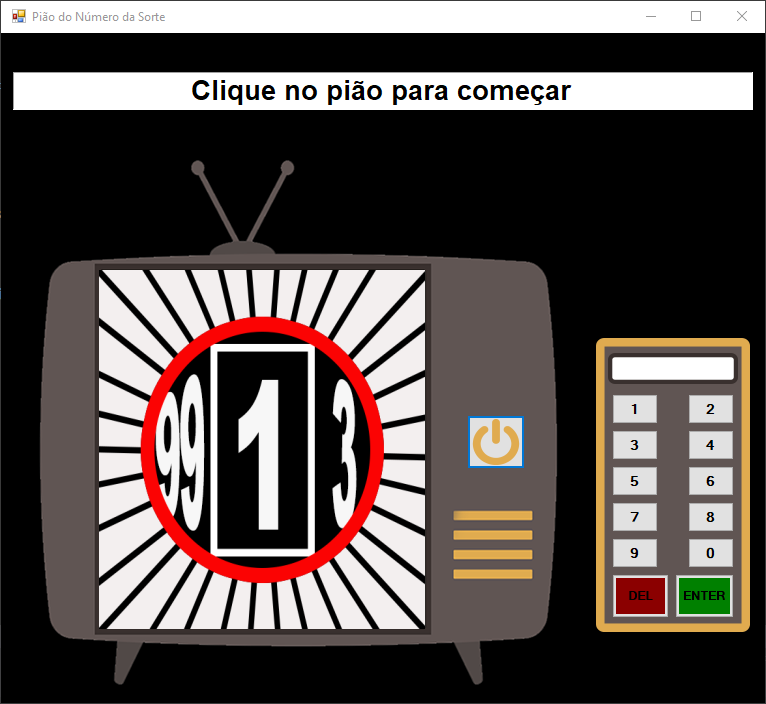

# Pião do número da sorte 🍀​



## Sobre

Projeto Windows Forms com C# e .NET Framework 4.5, desenvolvido no Visual Studio durante uma atividade da faculdade. O intuito do trabalho é colocar em prática alguns conhecimentos obtidos durante as aulas, como funções, procedimentos e eventos.

Após clicar no pião, é sorteado um número ímpar aleatório, entre 1 e 100. Utilizando os botões da tela, o usuário deve adivinhar qual é o número que foi sorteado.

## Como utilizar

Para visualizar o programa, bastar abrir o arquivo ```JogoPiao.exe``` localizado na pasta ```JogoPiao\bin\Debug```. Para visualizar no Visual Studio o projeto completo e seus arquivos, basta abrir o arquivo ```JogoPiao.sln```.
